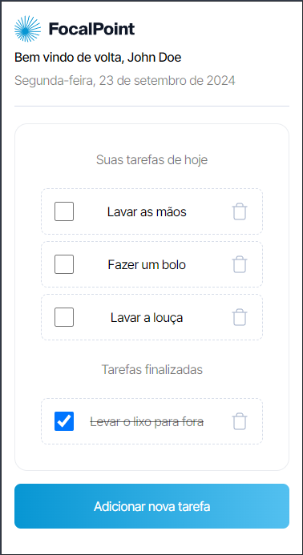

# 📝 Legaplan To-Do List App


  
Esta é uma aplicação de lista de tarefas (To-Do List) desenvolvida em **Next.js 14** e estilizada com **SCSS** como parte de um processo seletivo para a empresa **Legaplan**. A aplicação segue a metodologia **Mobile First** para garantir uma ótima experiência de uso em dispositivos móveis e desktops.

## 🚀 Funcionalidades

- **Visualização de tarefas**: Veja todas as tarefas listadas.
- **Adicionar tarefa**: Crie novas tarefas rapidamente.
- **Marcar como finalizadas ou não**: Alterne entre tarefas concluídas e pendentes.
- **Remover tarefas**: Exclua tarefas que não são mais necessárias.

## 🛠️ Tecnologias Utilizadas

- **Next.js**: Framework React para criação de aplicações web.
- **SCSS**: Utilizado para estilizar a aplicação.
- **Jest**: Framework de testes para garantir a confiabilidade da aplicação.
- **React Testing Library**: Utilizado para testar componentes React de forma simples e eficaz.

## 📱 Metodologia Mobile First

A aplicação foi desenvolvida utilizando a metodologia **Mobile First**, o que significa que a interface foi inicialmente criada para dispositivos móveis e depois adaptada para telas maiores, como tablets e desktops. Isso garante uma boa experiência de usuário, independentemente do dispositivo utilizado.

## 🧪 Testes

- A aplicação foi testada usando **Jest** e **React Testing Library** para garantir que as funcionalidades estão funcionando corretamente.
- Para rodar os testes, utilize o comando:

  ```bash
  npm run test
  ```

## 🖼️ Demonstração

- Ao acessar a página principal, você pode visualizar todas as tarefas, adicionar novas, marcar como concluídas ou excluí-las.
- Clique no botão "Adicionar nova tarefa" para criar uma nova tarefa.
- Marque a caixa de seleção para concluir uma tarefa.
- Utilize o botão de lixeira para excluir uma tarefa.

## 📦 Instalação e Execução

1. Clone o repositório:

   ```bash
   git clone https://github.com/seu-usuario/legaplan-todolist.git
   ```

2. Instale as dependências:

   ```bash
   npm install
   ```

3. Execute a aplicação:

    ```bash
    npm run dev
    ```

4. Acesse a aplicação em seu navegador:

    ```bash
    http://localhost:3000
    ```
